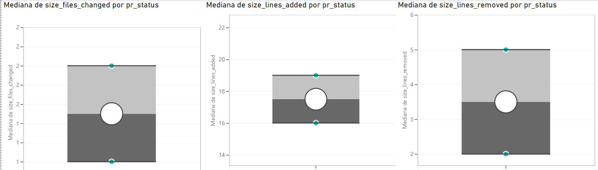
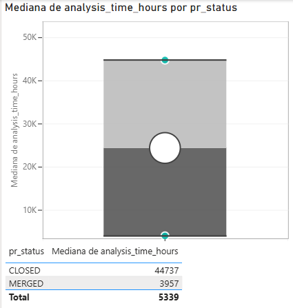
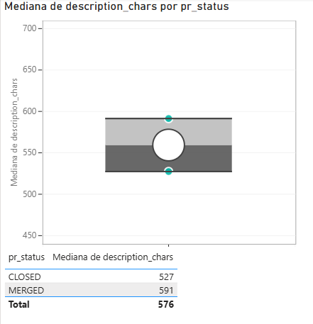
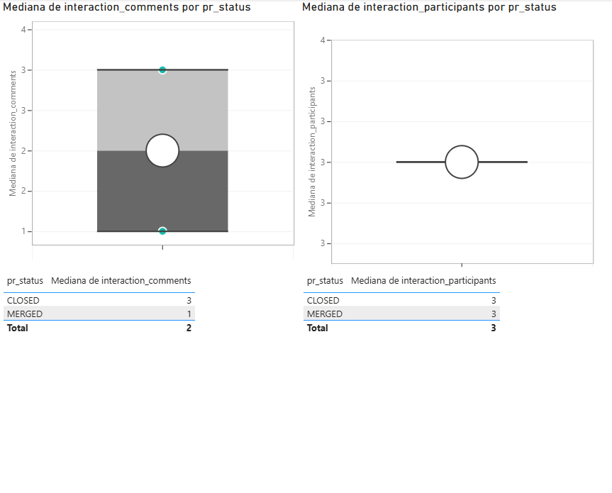
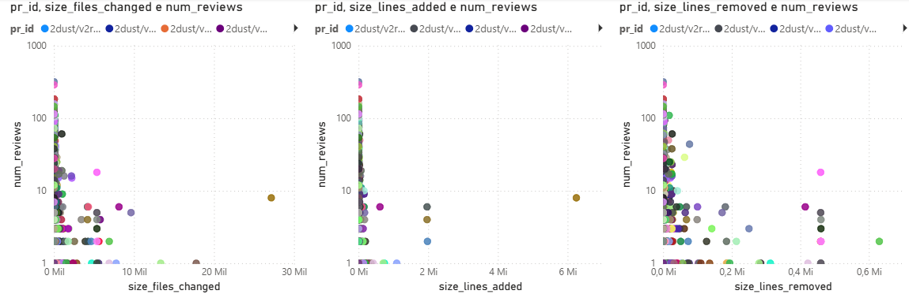
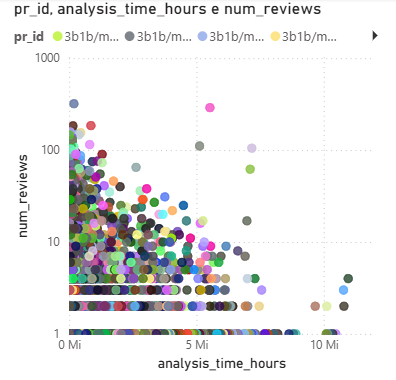
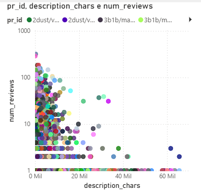
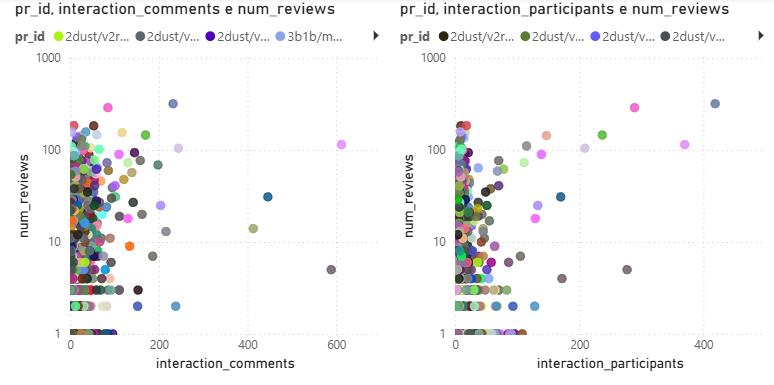

# 🧪 Laboratório 03 – Caracterizando a Atividade de Code Review no GitHub

**Alunos:**  
- Luiz Felipe Campos de Morais  
- Marcus Vinícius Carvalho de Oliveira  

---

## 📌 Introdução
A prática de **code review** é essencial em processos de desenvolvimento ágeis, garantindo a qualidade do código integrado e evitando a introdução de defeitos.  
No contexto de sistemas *open source* desenvolvidos no GitHub, o processo acontece principalmente por meio da avaliação de **Pull Requests (PRs)**, que podem ser aprovados (MERGED) ou rejeitados (CLOSED) após análise manual ou automática.  

O objetivo deste laboratório é **analisar a atividade de code review em repositórios populares do GitHub**, identificando fatores que influenciam o *merge* de PRs, sob a perspectiva dos desenvolvedores que submetem contribuições.  

---

## ❓ Questões de Pesquisa

As questões foram divididas em duas dimensões principais:  

### A. Feedback Final das Revisões (Status do PR)
- **RQ01:** Qual a relação entre o **tamanho dos PRs** e o feedback final das revisões?  
- **RQ02:** Qual a relação entre o **tempo de análise dos PRs** e o feedback final das revisões?  
- **RQ03:** Qual a relação entre a **descrição dos PRs** e o feedback final das revisões?  
- **RQ04:** Qual a relação entre as **interações nos PRs** e o feedback final das revisões?  

### B. Número de Revisões
- **RQ05:** Qual a relação entre o **tamanho dos PRs** e o número de revisões realizadas?  
- **RQ06:** Qual a relação entre o **tempo de análise dos PRs** e o número de revisões realizadas?  
- **RQ07:** Qual a relação entre a **descrição dos PRs** e o número de revisões realizadas?  
- **RQ08:** Qual a relação entre as **interações nos PRs** e o número de revisões realizadas?  

---

## 💡 Hipóteses Informais

- **RQ01:** PRs maiores (mais arquivos ou linhas alteradas) terão maior chance de rejeição.  
- **RQ02:** PRs analisados mais rapidamente tendem a ser aceitos; tempos longos podem indicar discussões ou problemas.  
- **RQ03:** PRs com descrições detalhadas têm maior probabilidade de aprovação.  
- **RQ04:** PRs com mais interações (comentários/participantes) tendem a ser mais discutidos, aumentando a chance de aprovação.  
- **RQ05:** PRs maiores exigem mais revisões para serem aprovados.  
- **RQ06:** PRs com maior tempo de análise recebem mais rodadas de revisão.  
- **RQ07:** PRs com descrições mais detalhadas demandam menos revisões adicionais.  
- **RQ08:** PRs com mais interações exigem mais revisões.  

---

## ⚙️ Metodologia

1. **Seleção de Repositórios**  
   - Repositórios populares: top **200 mais populares do GitHub**.  
   - Critério mínimo: **100 PRs (MERGED + CLOSED)** por repositório e limitamos para os primeiros 500 PRs.  

2. **Seleção de Pull Requests**  
   - Considerados apenas PRs:  
     - com status **MERGED** ou **CLOSED**;  
     - com pelo menos **uma revisão**;  
     - cujo tempo entre criação e merge/close seja **maior que 1 hora** (para excluir revisões automáticas).  

3. **Métricas Extraídas**  
   - **Tamanho:** número de arquivos modificados; linhas adicionadas e removidas.  
   - **Tempo de Análise:** intervalo entre criação e última atividade.  
   - **Descrição:** número de caracteres no corpo de descrição do PR.  
   - **Interações:** número de participantes; número de comentários.  

4. **Análise Estatística**  
   - Cálculo de **valores medianos** para todas as métricas.  
   - Aplicação de **testes de correlação (Spearman ou Pearson)** para validar as relações.  
   - Visualização dos resultados em **tabelas e gráficos**.  

---

## 📊 Resultados

### 🔹 RQ01: Tamanho dos PRs × Feedback Final
📈   

| Métrica       | Mediana (Aprovados) | Mediana (Rejeitados) |
|---------------|----------------------|-----------------------|
| Arquivos      |          2           |           1           |
| Linhas +      |          19          |           16          |
| Linhas -      |          5           |           2           |

---

### 🔹 RQ02: Tempo de Análise × Feedback Final
📈    

| Métrica       | Mediana (Aprovados) | Mediana (Rejeitados) |
|---------------|----------------------|-----------------------|
| Tempo (horas) |          3.9         |           44.7        |

---

### 🔹 RQ03: Descrição × Feedback Final
📈    

| Métrica                | Mediana (Aprovados) | Mediana (Rejeitados) |
|-------------------------|----------------------|-----------------------|
| Nº caracteres descrição |          591         |          527          |

---

### 🔹 RQ04: Interações × Feedback Final
📈   

| Métrica        | Mediana (Aprovados) | Mediana (Rejeitados) |
|----------------|----------------------|-----------------------|
| Comentários    |          1           |           3           |
| Participantes  |          3           |           3           |

---

### ℹ️ Explicação dos Coeficientes de Correlação

O **coeficiente de correlação (ρ)** varia de **-1 a 1** e indica a força e direção da relação entre duas variáveis:

| Valor de ρ          | Interpretação                  |
|--------------------|--------------------------------|
| 0.0 a 0.2          | Muito fraca                     |
| 0.2 a 0.4          | Fraca                            |
| 0.4 a 0.6          | Moderada                         |
| 0.6 a 0.8          | Forte                            |
| 0.8 a 1.0          | Muito forte                      |

O **p-valor (p-value)** indica se a correlação observada é estatisticamente significativa:

| Condição            | Interpretação                                          |
|--------------------|--------------------------------------------------------|
| p-valor < 0.05      | Correlação **estatisticamente significativa**; provavelmente existe de fato. |
| p-valor ≥ 0.05      | Correlação **não significativa**; pode ter ocorrido por acaso. |

> ⚠️ Observação: mesmo correlações fracas podem ser significativas em grandes conjuntos de dados. Sempre avalie o valor de ρ junto com o p-valor para interpretar corretamente os resultados.

---

### 🔹 RQ05: Tamanho × Nº de Revisões
📈    

| Métrica   | Correlação | Teste Estatístico |
|-----------|------------|-------------------|
| Arquivos  |   0.2848   |   P-valor = 0.0000 /  É estatisticamente relevante            |
| Linhas +  |   0.3296   |   P-valor = 0.0000 /  É estatisticamente relevante            |
| Linhas -  |   0.1963   |   P-valor = 0.0000 /  É estatisticamente relevante            |

---

### 🔹 RQ06: Tempo de Análise × Nº de Revisões
📈   

| Métrica       | Correlação | Teste Estatístico |
|---------------|------------|-------------------|
| Tempo (horas) |   0.2186   |   P-valor = 0.0000 /  É estatisticamente relevante            |

---

### 🔹 RQ07: Descrição × Nº de Revisões
📈   

| Métrica                | Correlação | Teste Estatístico |
|-------------------------|------------|-------------------|
| Nº caracteres descrição |   0.1543   |   P-valor = 0.0000 /  É estatisticamente relevante            |

---

### 🔹 RQ08: Interações × Nº de Revisões
📈  

| Métrica       | Correlação | Teste Estatístico |
|---------------|------------|-------------------|
| Comentários   |    0.3139        |   P-valor = 0.0000 /  É estatisticamente relevante            |
| Participantes |    0.4652        |   P-valor = 0.0000 /  É estatisticamente relevante            |

---

## 🗣️ Discussão

### RQ01: Tamanho dos PRs × Feedback Final
- **Hipótese:** PRs maiores teriam maior chance de rejeição.  
- **Resultado:** Hipótese refutada. PRs aprovados apresentaram medianas de arquivos, linhas adicionadas e removidas maiores que PRs rejeitados. Isso sugere que mudanças muito pequenas podem ser mais propensas à rejeição, enquanto contribuições um pouco mais substanciais têm maior chance de aprovação.

### RQ02: Tempo de Análise × Feedback Final
- **Hipótese:** PRs analisados rapidamente seriam aceitos.  
- **Resultado:** Hipótese confirmada. A mediana de tempo para PRs rejeitados foi 44.7 horas, mais de 10 vezes a mediana dos aprovados (3.9 horas), indicando que longos períodos de análise estão associados a rejeições.

### RQ03: Descrição × Feedback Final
- **Hipótese:** Descrições detalhadas aumentam a chance de aprovação.  
- **Resultado:** Hipótese confirmada. PRs aprovados tiveram mediana de 591 caracteres na descrição, superior aos 527 dos rejeitados, mostrando que uma comunicação clara auxilia na aceitação.

### RQ04: Interações × Feedback Final
- **Hipótese:** Mais interações aumentariam a chance de aprovação.  
- **Resultado:** Hipótese parcialmente refutada. O número de participantes foi igual (3), e PRs rejeitados tiveram mais comentários (3 vs 1), indicando que muitos comentários podem sinalizar problemas ou discordâncias, e não necessariamente colaboração positiva.

### RQ05: Tamanho × Nº de Revisões
- **Hipótese:** PRs maiores exigiriam mais revisões.  
- **Resultado:** Hipótese confirmada. Correlação positiva fraca, mas significativa (rho entre 0.196 e 0.330), mostrando que mudanças maiores passam por mais ciclos de revisão.

### RQ06: Tempo de Análise × Nº de Revisões
- **Hipótese:** Maior tempo de análise se correlaciona com mais revisões.  
- **Resultado:** Hipótese confirmada. Correlação positiva fraca (rho = 0.2186) e significativa indica que PRs com maior duração tendem a acumular mais revisões.

### RQ07: Descrição × Nº de Revisões
- **Hipótese:** Descrições detalhadas demandariam menos revisões.  
- **Resultado:** Hipótese refutada. Correlação positiva muito fraca (rho = 0.1543), mas significativa, sugere que descrições longas estão ligadas a mudanças mais complexas, que naturalmente requerem mais revisões.

### RQ08: Interações × Nº de Revisões
- **Hipótese:** Mais interações exigiriam mais revisões.  
- **Resultado:** Hipótese confirmada. Correlação positiva significativa, sendo a correlação com participantes a mais forte do estudo (rho = 0.4652), mostrando que maior atenção de múltiplos revisores aumenta o número de ciclos de revisão.

---

